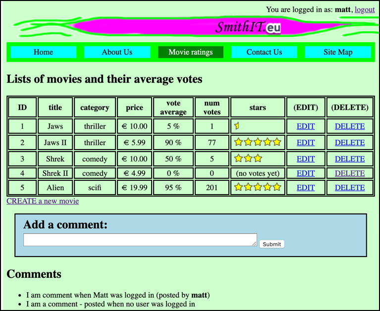

# evote-movie-2020-26-comment-user-association

If a user **IS** logged-in when a comment is created, let's link that `Comment` object to the User's `id`.

This screenshot shows how, if we find a user-ID stored in a `Comment` object, we can display the username of the `User` that posted the comment.



- let's add a `userId` to the `Comment` entity class, and to the create table SQL:

    ```php
    class Comment
    {
        const CREATE_TABLE_SQL =
            <<<HERE
    CREATE TABLE IF NOT EXISTS comment (
        id integer PRIMARY KEY AUTO_INCREMENT,
        comment text,
        userId integer
    )
    HERE;
    
        private $id;
        private $comment;
        private $userId;
    ```

- We must reset our DB, so we add this new field to database table `comment`

- also, when we have a `Comment` object, we want to know the `User` linked to it (if not NULL), to let's add a new `getUser()` method to our `Comment` class. This means, for example, in Twig we can write things like `commment.user.username`, to get the `username` property of the `User` object from a `Comment` object. Remember, Twig knows about get/set methods, so writing `comment.user` is a way to invoke the `getUser()` method of a `Comment` object:
    
    ```php
    public function getUser()
    {
        // if not NULL userUId, then find and return associated user
        if(!empty($this->userId)){
            $userRepository = new UserRepository();
            return $userRepository->find($this->userId);
        }
    
        // if userId NULL, then return NULL
        return null;
    }
    ```

- we'll need to get the username from the logged-in user, so let's add a new method to `LoginController`:

    ```php
    <?php
    namespace Tudublin;
    
    class LoginController extends Controller
    {
        ... other methods as before     
    
        public function userNameFromSession()
        {
            if($this->isLoggedIn()){
                return $_SESSION['username'];
            }
    
            return null;
        }
    ``` 

- now we need to add some logic to our `MainController` so that when a comment is being created, we check to see if there is a user logged-in, if so, we get the `username` from the session, then retrieve the `User` record from the database, and store the `id` of that user in the new `userId` property of the `Comment` object being created:

    ```php
    <?php
    namespace Tudublin;
    
    class MainController extends Controller
    {
        public function processNewComment()
        {
            $commentText = filter_input(INPUT_POST, 'comment');
    
            // only create a comment if it's not an empty string
            if(!empty($commentText)) {
                $comment = new Comment();
                $comment->setComment($commentText);
    
                // store logged-in user ID, if a user is logged-in
                $loginController = new LoginController();
                if($loginController->isLoggedIn()){
                    $userName = $loginController->userNameFromSession();
                    $loggedInUser = $this->userRepository->getUserByUserName($userName);
                    // store ID of logged-in user in new Comment object
                    $comment->setUserId($loggedInUser->getId());
                }
    
                $this->commentRepository->create($comment);
            }
            
            // display list of movies (and comments)
            $movieController = new MovieController();
            $movieController->listMovies();
        }
    
        ... other methods as before
    ```

- finally, we need to add to our Twig template `/templates/list.html.twig` to display the username of the user who authored the comment (if there was one store)

    ```twig
        ... list of movies etc. as before ...
    
        {# -------- loop to display comments as list items, if array size > 0 --------#}
        
            <h2>Comments</h2>
            <ul>
                
                    <li>
                        {{ comment.comment }}
                        
                            (posted by <b>{{ comment.user.username }}</b>)
                        
                    </li>
                
            </ul>
        
    
    
    ```


NOTE:
- We **could** have simply stored the logged in username as a string field in the `Comment` entity. However, this example is to illustrate how we can simply add a `<entity>Id` field to one class, with  a `get<Entity>()` method, to allow us to easily associate/relate entities in  one-to-one and many-to-one associations.

- now, if we have a `Comment` object we can use it's `getUser()` method to retrieve from the DB the associated `User` object who authored the comment (if there is one)
